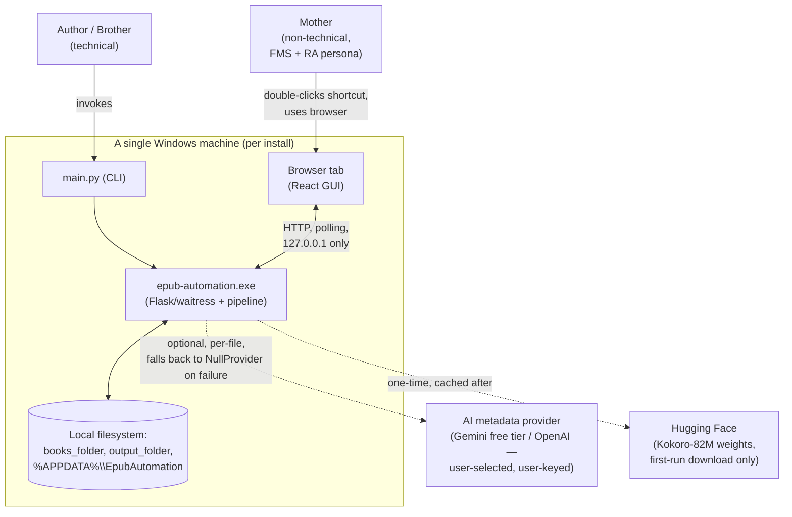
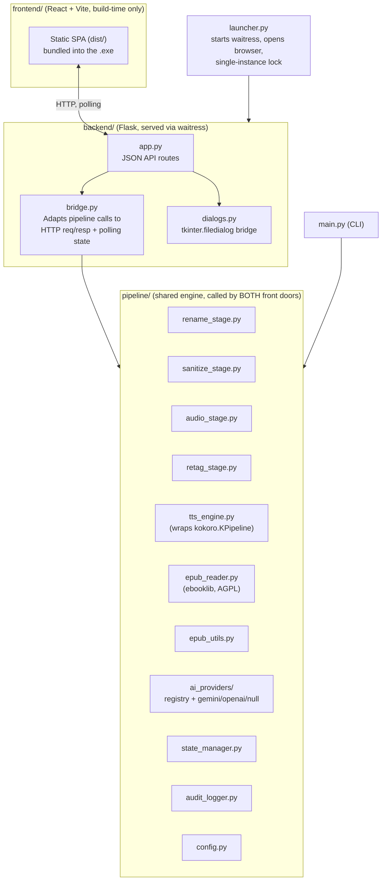
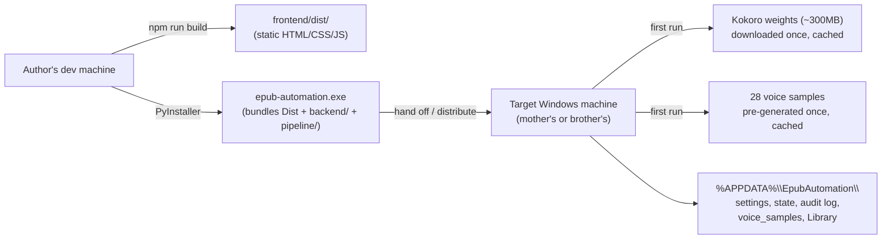

# epub-automation — High-Level System Design

Status: Draft for design-review pass
Source of truth for requirements: `requirements/` (this document is a
synthesis of it, not a replacement — if the two disagree, `requirements/`
wins until this doc is updated)
Companion: `design/adr/` — one ADR per binding architectural decision
referenced below

---

## 1. Purpose & Scope

`epub-automation` merges three existing standalone tools
(`epub-renamer`, `epub-sanitize`, `epub-to-audio`) into one batch
pipeline with two front doors:

- **CLI / advanced mode** — technical use (author, brother).
- **Accessible local web GUI** — non-technical use (author's mother),
  designed against two specific accessibility constraints: FMS
  (difficulty learning/holding multi-step processes in mind) and RA in
  the fingers (reduced fine-motor precision).

Secondary goal: a portfolio piece demonstrating one shared, tested
pipeline engine behind two front doors, real accessibility-driven design
(not just "big buttons"), and honest engineering documentation
(licensing, testing, this design doc).

Full functional detail lives in `requirements/00` through `10`. This
document is the connective tissue: how the pieces fit together, what
crosses which boundary, and why the shape of the system is what it is.

## 2. Non-Goals

Carried from `requirements/00-overview-and-goals.md` — not repeated in
full here, but worth stating up front because they shape the
architecture as much as the goals do:

- No formats other than `.epub`.
- No mobile/tablet support, Windows tablets included — laptop/desktop
  Windows only.
- No multi-user or networked GUI use — single machine, single user,
  `localhost`-bound.
- No auto-update mechanism for the shipped `.exe`.
- No voice cloning — fixed-voice selection only.

## 3. Context Diagram



Key properties visible at this level:

- Two entry points (`CLI`, `GUI`) both call into the **same** pipeline
  engine — neither contains pipeline logic itself (ADR-0001).
- The only two network dependencies are optional/best-effort
  (AI enrichment) or one-time (Kokoro weights) — the core pipeline
  (sanitize, audio) works fully offline once set up.
- Everything is per-machine, per-install — there is no shared server or
  account system across family members (ADR-0008).

## 4. Container View



Both `main.py` and `backend/bridge.py` are **thin callers** into
`pipeline/`. This is the load-bearing structural decision behind the
"one tested core, two front doors" portfolio claim
(`requirements/00`, `09-testing-strategy.md`) — see ADR-0001.

## 5. Runtime View — Pipeline Data Flow

```
books_folder (hers)
      │  [copy, never move — originals untouched]
      ▼
Library/00-Incoming/  ──[rename, optional]──▶  Library/01-Renamed/
                                                        │
                                                [sanitize, optional]
                                                        ▼
                                                Library/02-Sanitized/ ──copy──▶ output_folder
                                                        │
                                                   [audio, per book,
                                                    serial, voice picked
                                                    here]
                                                        ▼
                                                Library/03-Audio/<book>/ ──copy──▶ output_folder
                                                        │
                                              [retag — always manual,
                                               triggered from Review
                                               screen or run standalone]
```

Notes that matter architecturally (full detail in
`requirements/01-architecture.md` §Folder mapping and
`02-pipeline-stages.md`):

- `Library/*` is **not** a dev-time-only convenience folder at runtime —
  it lives under `%APPDATA%\EpubAutomation\Library\`, for the same
  writability/update-survival reasons as `settings.json`.
- `output_folder` receives two artifacts per book, added incrementally
  as each is ready (not batched at the end): the cleaned/renamed EPUB as
  soon as sanitize finishes, and the finished audiobook as soon as audio
  finishes. This means a partial failure in the audio stage still leaves
  her with a usable renamed/cleaned EPUB.
- A shared state file (`state_manager.py`) tracks per-file, per-stage
  completion, independent of the audit log (human-readable history) —
  this is what makes resume-after-interruption and the "Welcome back"
  screen possible without a separate crash-detection mechanism.
- Voice selection happens **after** the per-book identification loop
  completes for the whole batch, not per-stage in isolation — a book's
  identity (genre, series) isn't knowable until after renaming.

## 6. The GUI/Backend Contract

The React frontend and Flask backend communicate over a single polling
status endpoint (not WebSockets — chosen for robustness through a
long-lived local server, and because a glanced-at progress screen
doesn't need push updates). The full response shape (`state`, `books`,
`active_book_id`, `message`, `needs_input`, `error`) is specified in
`requirements/01-architecture.md` §Status endpoint contract and is the
one contract every GUI screen in `03-gui-ux-design.md` is built against.

Architecturally significant property: **this endpoint is not a second
source of truth.** Its response must be fully reconstructable from the
on-disk state file at any time, including after a backend restart — this
is what makes "Continue where you left off?" a read of existing state
rather than a separate resume subsystem.

## 7. Cross-Cutting Concerns

### 7.1 Security

- **Localhost-only binding** (ADR-0008) — the Flask API can pop native
  file dialogs and read/write arbitrary paths under its own reach, and
  has no authentication. Binding to `127.0.0.1` only, as a fixed
  constant (never a setting/env var/flag), is what makes that
  acceptable.
- **Input validation runs entirely at Screen 1**, synchronously, before
  "Start" is reachable: extension check, real-zip validity check, and
  DRM detection (`META-INF/encryption.xml` presence) all happen in one
  pass per file. Nothing downstream has to handle "this wasn't actually
  a valid EPUB."
- **Zip safety guards** (path traversal on extract and repack, zip-bomb
  cap, XXE prevention) apply to **every** stage that opens a zip, not
  just sanitize — including the Screen 1 validation pass itself, since
  that's the first code to open the zip at all.
- **Secrets never leave the machine except through the provider's own
  API call.** `ai_api_key` is stored in plaintext in `settings.json`
  (acceptable given the localhost-only, single-user posture) but is
  explicitly excluded from the "Copy details for support" bundle and
  never written to the audit log.

### 7.2 Resilience & Long-Run Safety

- Per-chunk resume (skip-if-MP3-exists-above-threshold) is the load-
  bearing recovery mechanism for the multi-hour audio stage — laptop
  sleep, a crash, or a forced quit must not lose more than the
  in-flight chunk.
- Single-instance locking, shared by both `main.py` and `launcher.py`,
  protects both the state file's integrity and Kokoro's memory
  footprint (two concurrent inference jobs on one machine is a resource
  problem even with a perfectly concurrency-safe state file).
- `settings.json` and the state file are both written via
  write-to-temp-then-atomic-rename — never in-place — because a
  corrupted, unparseable settings file has an outsized cost for this
  persona specifically (a from-scratch redo of folder setup, word list,
  and AI key, with no explanation why).
- Resume/"Welcome back" detection is **state-file-driven, not
  crash-detection-driven** — deliberately simpler, since it doesn't
  need to distinguish a clean stop from a crash from a lost-power event.

### 7.3 Accessibility (drives the GUI layer specifically)

Every GUI decision in `requirements/03-gui-ux-design.md` is evaluated
against two concrete constraints, not a generic "make it simple" goal:

- **FMS** → one decision per screen, plain language (internal
  terminology never surfaces to her — see the terminology mapping
  table), consistent/repeated patterns across screens (one Field
  Correction Popup reused everywhere, not several bespoke editors).
- **RA (fine motor)** → large click targets (~70px+), fully-clickable
  rows (not just the radio circle), no double-click/right-click/hover-
  reveal, full-replace text editing instead of cursor positioning.

This is why the system has, e.g., one shared `Field Correction Popup`
component rather than three separate editing UIs, and why Pause/Cancel
are visually and textually distinguished rather than relying on color
alone.

### 7.4 Cost & Resource Safety

- Disk-space and AI-cost safety both became real (not just hygienic)
  concerns once the AI provider became user-selectable and could be a
  paid provider — see ADR-0003. A fixed, sane `MAX_FILES`-style per-run
  cap and a pre-batch disk estimate (accounting for the fact that a
  book's content exists copied in multiple places at once — incoming,
  sanitized, and audio output) both exist for this reason.

### 7.5 Testing (backs the "same tested core" portfolio claim)

- 80%+ line coverage floor, backend (`pytest-cov`) and frontend
  (Vitest), enforced in CI, not just documented.
- TDD discipline specifically for pipeline stage transforms, every
  security guard, atomic-write logic, and the disk-space/time-estimate
  formulas — see `requirements/09-testing-strategy.md`.
- Security guards get adversarial fixtures (real crafted malicious zips),
  not just mocked inputs, and are the one area targeted at near-100%
  rather than the 80% floor.

### 7.6 Reuse as a Design Principle

This isn't incidental — the requirements consistently treat "port and
reuse the existing, working implementation" as the default, with a new
implementation only where there's a concrete reason (a changed
constraint, a genuine gap, or a bug fix). This shows up as a distinct
pattern across multiple stages, not just once:

| Reused verbatim / near-verbatim | New / changed, and why |
|---|---|
| `FILENAME_PATTERN` regex and its already-normalized-skip behavior (`epub-renamer/renamer.py`) | MP3 encoding parameters (128kbps/mono/48kHz) — the original tool never encoded MP3 itself, so this is a genuinely new decision (ADR-0002) |
| `chunk_text()` and `MAX_CHUNK_CHARS = 4,000` (`epub-to-audio/epub_utils.py`) — carried over even though it was tuned for Perchance, not Kokoro, pending re-validation | The `ai_providers/` registry — the original tools had no pluggable-provider concept at all (ADR-0003) |
| 3-tier metadata resolution priority, chapter extraction, `--stop-after` truncation, ID3 tagging, resume-by-existing-MP3 logic | The retag stage's folder-rename fix — a genuine bug in the original `retag.py` (renamed files but never the containing folder), fixed during the port, not carried over |
| `retag.py`, ported into `pipeline/retag_stage.py` "largely as-is" | Zip-safety guards extended to every stage that opens a zip, not just sanitize (previously only implicit in the original PowerShell script's scope) |
| Every one of the sanitize stage's original security controls (path traversal, zip-bomb cap, XXE prevention, whole-word matching, asterisk replacement) — see ADR-0004 | The unified cross-stage audit log — the three original tools had no shared logging; this is new integration, not a port |
| The `epub-renamer` test suite (`pytest`, `black`, `ruff`, `mypy --strict` toolchain and existing tests for `epub_reader`, `renamer`, `state_manager`) — ported with import paths updated, not rewritten (`requirements/09-testing-strategy.md`) | `pytest-cov` and the 80% coverage gate — the one piece of the existing toolchain not already present |

The practical effect: **only `epub-sanitize` needs a from-scratch
language port** (PowerShell → Python, ADR-0004), and even that preserves
every security control exactly rather than redesigning them. `epub-to-audio`
and `epub-renamer` are already Python and are integrated with minimal
structural change — the pipeline stages are largely their existing logic
relocated into a shared module layout (§4), not rewritten. See ADR-0014
for this as its own decision record, since it's the umbrella rationale
behind several stage-specific ADRs (0002, 0004, 0009) rather than a
one-off note in each.

## 8. Deployment View



Each family member runs their own separate install, on their own
machine, with its own `%APPDATA%\EpubAutomation\` — there is no shared
or networked instance (ADR-0008, ADR-0007). New-machine migration is
explicitly out of scope: a fresh install plus re-pointing "Change my
folders" is the supported path.

## 9. Known Gaps / Deferred Decisions

Carried from `requirements/08-open-questions-and-assumptions.md` — not
re-litigated here, but flagged because they affect confidence in parts
of this design until resolved:

| Item | Affects |
|---|---|
| Kokoro vs. Perchance output parity (quality, pacing, sample rate) not yet verified side-by-side | §5 audio stage, ADR-0002 |
| CPU-vs-GPU throughput on actual target hardware not yet benchmarked | Working-screen time estimate, disk-space formula's `SECONDS_PER_CHAR` constant |
| `MAX_CHUNK_CHARS = 4,000` inherited from Perchance-tuning, not re-validated for Kokoro | §5 audio stage |
| Gemini free-tier data-use trade-off assumed acceptable, not explicitly user-confirmed | ADR-0003 |
| Windows-only v1 scope assumed, not explicitly user-confirmed | ADR-0011 |
| Exact her-facing copy wording drafted for tone, not user-tested | §7.3 |

None of these block the design-review pass itself — they're
implementation/QA follow-ups, not open architectural questions.

## 10. Architecture Decision Records

Each binding decision referenced above (and a few structural ones not
called out inline) has a full ADR under `design/adr/`. See
`design/adr/README.md` for the index.
