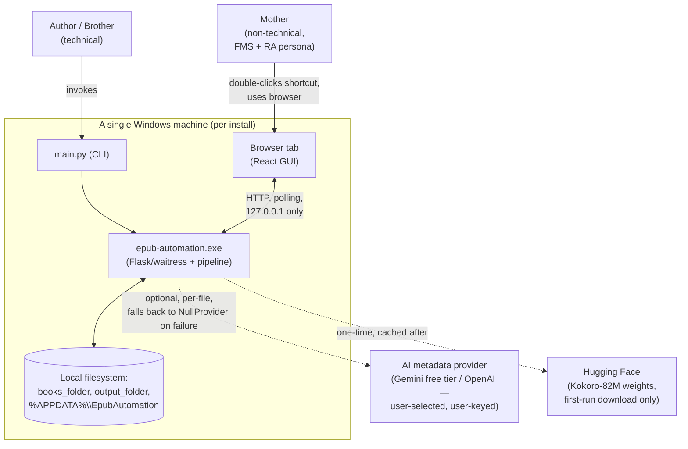
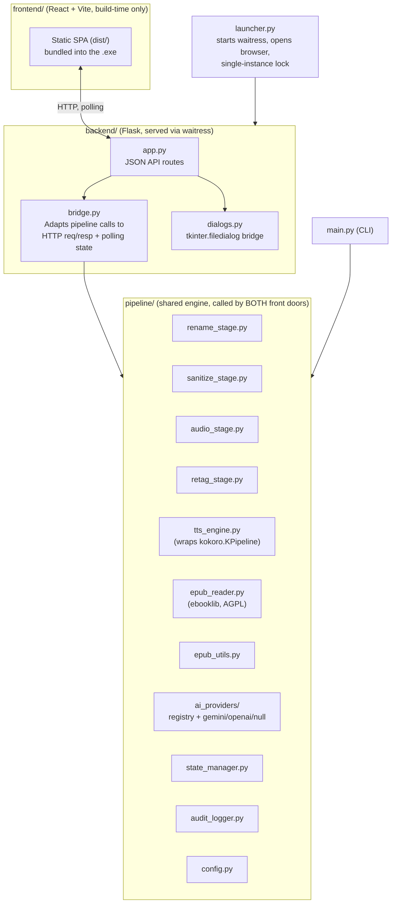
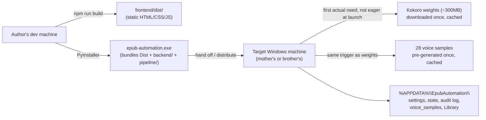

# epub-automation — High-Level System Design

Status: Draft for design-review pass
Source of truth for requirements: `docs/requirements/` (this document is
a synthesis, not a replacement)
Companion: `docs/design/adr/` (one ADR per binding decision),
`docs/design/PATTERNS.md` (implementation patterns), `docs/BACKLOG.md`
(build sequencing)

---

## 1. Purpose & Scope

`epub-automation` merges three existing standalone tools
(`epub-renamer`, `epub-sanitize`, `epub-to-audio`) into one batch
pipeline with two front doors:

- **CLI / advanced mode** — technical use (author, brother).
- **Accessible local web GUI** — non-technical use (author's mother),
  designed against two accessibility constraints: FMS (difficulty
  holding multi-step processes in mind) and RA (reduced fine-motor
  precision). Also layered with WCAG 2.1 AA alignment (ADR-0015, §7.3).

Secondary goal: portfolio piece — one shared, tested pipeline engine
behind two front doors, real accessibility-driven design, honest
engineering documentation.

Full functional detail: `docs/requirements/00`–`10`.

### 1.1 Source Projects

| Project | Repository | License | Language | Role here |
|---|---|---|---|---|
| `epub-renamer` | [github.com/Jinniyah/epub-renamer](https://github.com/Jinniyah/epub-renamer) | MIT | Python 3.11+ | Rename stage — `FILENAME_PATTERN`, `ai_providers/` registry, `state_manager.py`, `audit_logger.py`, `epub_reader.py` |
| `epub-sanitize` | [github.com/Jinniyah/epub-sanitize](https://github.com/Jinniyah/epub-sanitize) | None (author's own work) | PowerShell | Sanitize stage — `PS_Run-CleanUpEpub.ps1`, `profanity.txt` |
| `epub-to-audio` | [github.com/Jinniyah/epub-to-audio](https://github.com/Jinniyah/epub-to-audio) | MIT | Python 3.10+ | Audio + retag stages — `epub2audio.py`, `epub_utils.py`, `retag.py` |

Confirmed directly against source (not just requirements-doc
description): `epub-renamer` already implements the full pluggable
`ai_providers/` registry (`base.py`, `registry.py`, `openai_provider.py`,
`null_provider.py`) plus a `.env`-driven `MAX_FILES` cap and
`DRY_RUN=true` default — only `gemini_provider.py` is new (ADR-0003,
ADR-0014). `--max-chunk` defaults to `4000`, confirming
`MAX_CHUNK_CHARS`. All ten sanitize security controls and the retag
folder-rename bug (§7.6) were independently re-verified against source
during the pre-coding review (`docs/design_review.md`); that pass also
surfaced a Python-porting regex gotcha (ADR-0004).

## 2. Non-Goals

- No formats other than `.epub`.
- No mobile/tablet support — laptop/desktop Windows only (confirmed at
  backlog kickoff).
- No multi-user or networked GUI use — single machine, `localhost`-bound.
- No auto-update mechanism.
- No voice cloning — fixed-voice selection only.
- No certified WCAG conformance, no paid/legacy AT support (e.g. JAWS).

## 3. Context Diagram



Two entry points share the same pipeline engine (ADR-0001). Both
network dependencies are optional/one-time — core pipeline works
offline. Everything is per-machine, no shared server (ADR-0008).

## 4. Container View



`main.py` and `backend/bridge.py` are thin Adapter callers into
`pipeline/` — the load-bearing "one tested core, two front doors"
decision (ADR-0001). See `docs/design/PATTERNS.md`.

## 5. Runtime View — Pipeline Data Flow

```
books_folder (hers)
      │  [copy, never move — originals untouched]
      ▼
Library/00-Incoming/  ──[rename, optional]──▶  Library/01-Renamed/
                                                        │
                                                [sanitize, optional]
                                                        ▼
                                                Library/02-Sanitized/ ──copy──▶ output_folder
                                                        │
                                                   [audio, per book,
                                                    serial, voice picked
                                                    here]
                                                        ▼
                                                Library/03-Audio/<book>/ ──copy──▶ output_folder
                                                        │
                                              [retag — always manual,
                                               triggered from Review
                                               screen or run standalone]
```

- `Library/*` lives under `%APPDATA%\EpubAutomation\Library\` (same
  writability rationale as `settings.json`).
- `output_folder` receives artifacts incrementally per book, not
  batched — a failed audio stage still leaves a usable cleaned EPUB.
- `state_manager.py` tracks per-file, per-stage completion, independent
  of the audit log — enables resume + "Welcome back" without a separate
  crash-detection mechanism.
- Voice selection happens after per-book identification (a book's
  genre/series isn't known until after renaming).
- Kokoro model download + voice-sample generation trigger lazily, on
  first actual need (`04-tts-engine.md` §First-run setup).
- Stages implement a common `Stage` interface (Pipeline pattern) so
  `main.py`'s `all` command and the GUI's per-book loop share one
  ordered stage list — see `docs/design/PATTERNS.md` §1.

## 6. The GUI/Backend Contract

React and Flask communicate over a single polling status endpoint (not
WebSockets — robust through a long-lived local server, no push needed
for a glanced-at progress screen). Full response shape (`state`,
`books`, `active_book_id`, `message`, `needs_input`, `error`):
`01-architecture.md` §Status endpoint contract.

**Not a second source of truth** — reconstructable from the on-disk
state file at any time, including after a backend restart. Same
contract feeds the `aria-live` regions in §7.3.

**State derivation:** `state` is computed once, server-side, via a
fixed precedence rule over `books[]` (`01-architecture.md` §State
derivation) — implemented as a pure State Machine function, consumed on
the frontend through per-screen view-model hooks (e.g.
`useVoiceAssignmentView(books)`) — see `docs/design/PATTERNS.md` §1–2.

## 7. Cross-Cutting Concerns

### 7.1 Security

- **Localhost-only binding** (ADR-0008) — fixed constant, never
  configurable; the Flask API pops native dialogs and has no auth.
- **Input validation at Screen 1**, synchronously: extension check,
  real-zip validity, DRM detection (`META-INF/encryption.xml`),
  `MAX_FILES` cap — one pass per file, nothing silently truncated.
- **Zip safety guards** (path traversal, zip-bomb cap, XXE) apply to
  every zip-opening call site via a shared Template Method base
  (`SafeZipOperation`) — see `docs/design/PATTERNS.md` §1.
- **Secrets:** `ai_api_key` stored plaintext in `settings.json`
  (acceptable given localhost-only, single-user), excluded from the
  "Copy details for support" bundle and never logged.

### 7.2 Resilience & Long-Run Safety

- Per-chunk resume (skip-if-MP3-exists-above-threshold) is the
  load-bearing recovery mechanism for the multi-hour audio stage.
- Single-instance lock (shared by `main.py`/`launcher.py`) includes
  PID-based stale-lock detection (ADR-0007) — prevents an orphaned lock
  from a crash/forced-restart permanently blocking future launches.
- `settings.json` and state file: write-to-temp-then-atomic-rename,
  both carry a `schema_version` for migration (ADR-0005) — wrapped
  behind a Repository interface (`state_manager.py`, `audit_logger.py`).
- "Welcome back" detection is state-file-driven, not crash-detection —
  distinct from the stale-lock check (which only gates new launches).

### 7.3 Accessibility

Two distinct targets — see ADR-0015.

**Primary persona (real, validated by unassisted dry run):**
- **FMS** → one decision per screen, plain language, repeated patterns
  (one Field Correction Popup reused everywhere).
- **RA** → large click targets (~70px+), fully-clickable rows, no
  double-click/hover-reveal, full-replace text editing.

**WCAG 2.1 AA alignment (not certified — ADR-0015):**
- **Perceivable** — contrast minimums, no color-only meaning, text
  alternatives, resizable text, generous spacing.
- **Operable** — every clickable row is real-focusable, visible focus
  indicators, no drag-and-drop-only, focus-trap/return on overlays
  (`useFocusTrap()` hook — `docs/design/PATTERNS.md` §2).
- **Robust** — semantic HTML landmarks, real `<label>`-associated
  fields, `<table>` markup for the voice table.
- **Status updates** — `aria-live="polite"`/`"assertive"`, throttled
  (`useAriaLiveThrottled()` hook — `docs/design/PATTERNS.md` §2).

Full detail: `03-gui-ux-design.md` §Accessibility. Verification:
`09-testing-strategy.md` §Accessibility testing (dyslexic tester
identified, screen-reader tester pursued but unconfirmed).

### 7.4 Cost & Resource Safety

- `MAX_FILES` cap (ported from `epub-renamer`) + pre-batch disk
  estimate (accounts for a book existing copied in multiple places at
  once). Batch overflow rejects excess books individually at Screen 1,
  not silent truncation after Start (`06-safety-error-handling.md`).
- Gemini free-tier data-use trade-off accepted at backlog kickoff;
  OpenAI remains a first-class paid alternative.

### 7.5 Testing

- 80%+ line coverage floor (backend `pytest-cov`, frontend Vitest),
  CI-enforced.
- TDD for stage transforms, security guards, atomic-write logic,
  disk-space/time-estimate formulas.
- Security guards get adversarial fixtures (real crafted malicious
  zips), targeted near-100% — includes ReDoS-timeout and stale-lock
  regression tests (ADR-0004, ADR-0007).
- Accessibility: automated (`axe-core`, `eslint-plugin-jsx-a11y`,
  CI-enforced) + manual (keyboard-only, NVDA/Narrator, real testers).
- Per `docs/design/PATTERNS.md` §3, tests exercise each pattern's seam
  directly (e.g. `Stage` interface against a minimal fake).

### 7.6 Reuse as a Design Principle

Reuse-by-default is the consistent posture — new code only for a
changed constraint, real gap, or bug fix.

| Reused verbatim / near-verbatim | New / changed, and why |
|---|---|
| `FILENAME_PATTERN` regex + already-normalized-skip (`epub-renamer/renamer.py`) | MP3 encoding parameters (128kbps/mono/48kHz) — original tool never encoded MP3 (ADR-0002) |
| `chunk_text()` / `MAX_CHUNK_CHARS = 4,000` (`epub-to-audio/epub_utils.py`) — pending re-validation for Kokoro | `gemini_provider.py` — the one genuinely new provider (ADR-0003) |
| The entire `ai_providers/` registry (`base.py`, `registry.py`, `openai_provider.py`, `null_provider.py`) — Strategy/Registry pattern | Unified cross-stage audit log — no shared logging existed before |
| `MAX_FILES` cap + `DRY_RUN=true` default (`epub-renamer`'s `.env` config) | Zip-safety guards extended to every zip-opening stage, not just sanitize |
| 3-tier metadata resolution, chapter extraction, `--stop-after`, ID3 tagging, resume-by-existing-MP3 (`epub-to-audio`) | Retag folder-rename fix — genuine bug in original `retag.py` (renamed files, not the folder) |
| `retag.py`, ported "largely as-is" | WCAG 2.1 AA alignment layer — none of the three source tools had any GUI |
| All 10 sanitize security controls (`epub-sanitize/PS_Run-CleanUpEpub.ps1`, ADR-0004) | Single-instance lock's PID stale-lock check — no prior multi-front-door locking to reuse |
| `epub-renamer`'s test toolchain (`pytest`, `black`, `ruff`, `mypy --strict`, existing tests) | `pytest-cov`, 80% gate, `axe-core`/`eslint-plugin-jsx-a11y` — none existed to reuse |

**Practical effect:** only `epub-sanitize` needs a from-scratch language
port (ADR-0004); the other two contribute entire subsystems wholesale.
New work concentrates in: one provider, MP3 params, the audit log, the
WCAG layer, schema-versioning/stale-lock fixes, one bug fix. See
ADR-0014/ADR-0015.

**Licensing nuance:** `ebooklib` (AGPL) isn't newly introduced —
`epub-renamer`'s own `epub_reader.py` already imports it, though that
source repo's own README only claims "MIT License" with no AGPL
mention. `10-licensing-and-notices.md`/ADR-0012 document this more
rigorously than the source it came from.

## 8. Deployment View



Each family member runs a separate install with its own `%APPDATA%`
(ADR-0008, ADR-0007). New-machine migration out of scope — fresh
install + re-pointing folders is the supported path.

**Packaging risk fully resolved (Epic 1, verified 2026-07-08):**
`kokoro==0.9.4` → `espeakng-loader==0.2.4` ships `espeak-ng.dll` +
data as a wheel, loaded via ctypes (invisible to PyInstaller's static
analysis). Full build+exe test surfaced three further data-package
gaps (`language_tags`, `misaki`, `soundfile`) plus one new runtime
dependency (`en_core_web_sm`, pre-installed to avoid misaki's
frozen-exe-incompatible `pip`-download fallback). Confirmed flag set:
`--collect-data espeakng_loader/language_tags/misaki`,
`--collect-all en_core_web_sm/torch/transformers/kokoro/soundfile`.
`.exe` is multi-gigabyte (torch alone ~750MB), as expected.
`dist\kokoro_spike.exe` run standalone on Windows produced a real 153KB
`spike_output.wav`. Full detail: `spike/kokoro_spike.py`,
`07-packaging-deployment.md` §Known packaging constraints.

## 9. Known Gaps / Deferred Decisions

| Item | Affects |
|---|---|
| Kokoro vs. Perchance output parity not yet verified side-by-side | §5, ADR-0002 |
| CPU-vs-GPU throughput not yet benchmarked | Time estimate, `SECONDS_PER_CHAR` |
| `MAX_CHUNK_CHARS = 4,000` inherited from Perchance-tuning, not re-validated | §5 |
| Her-facing copy wording drafted, not user-tested | §7.3 |
| Screen-reader tester not confirmed — "designed/tested against criteria," not "validated by a blind user" until then | §7.3, ADR-0015 |
| **Resolved (Epic 1, 2026-07-08):** PyInstaller packaging — full flag set confirmed, `.exe` verified end-to-end | §8, `spike/kokoro_spike.py` |

Gemini data-use trade-off and Windows-only scope are both confirmed,
not deferred (backlog kickoff). None of the remaining items block the
design-review pass — they're implementation/QA follow-ups.

## 10. Architecture Decision Records

One ADR per binding decision under `docs/design/adr/` — see
`docs/design/adr/README.md` for the index and the design-review
post-fixes summary.

## 11. Design Patterns

`docs/design/PATTERNS.md` — Strategy/Registry (`ai_providers/`),
Pipeline (`Stage` interface), State Machine (`state` derivation, §6),
Repository (`state_manager.py`/`audit_logger.py`), Template Method
(zip-safety guards, §7.1), plus the React hooks for polling, focus
management, and view-models (§7.3, §6).

## 12. Implementation Backlog

`docs/BACKLOG.md` sequences all of the above into epics: scaffolding →
sanitize port + Kokoro spike (parallel, highest risk) → remaining
stages → backend contract → frontend + accessibility → packaging/QA/docs.
Every open item from §9 is a concrete backlog item, not just a footnote.
</content>
