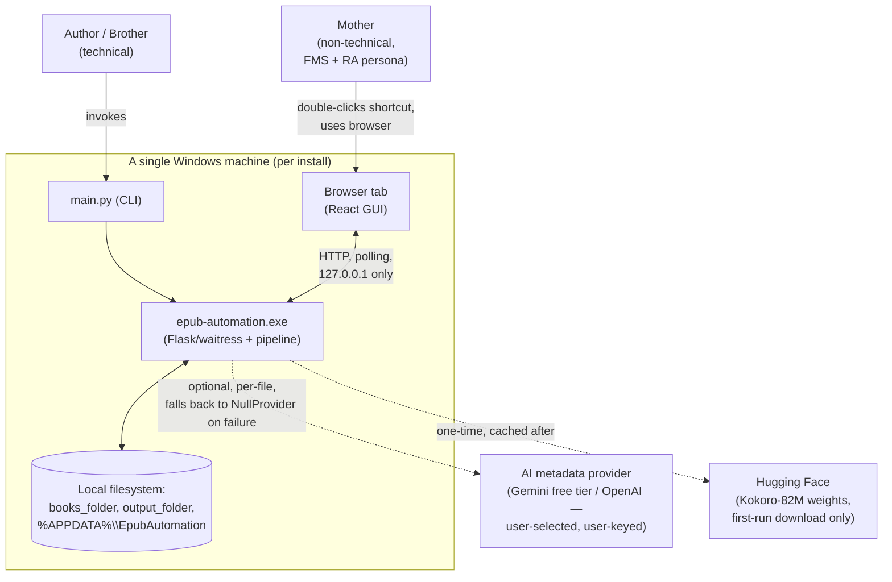
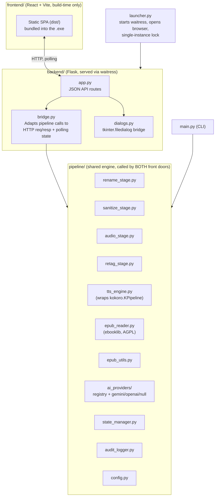
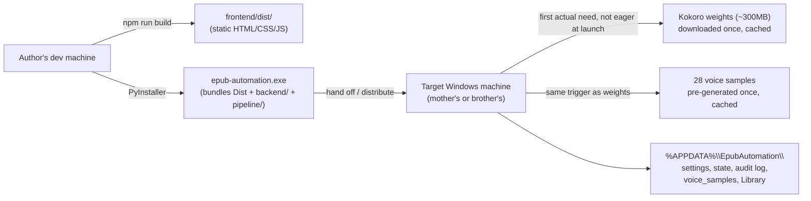

# epub-automation — High-Level System Design

Status: Draft for design-review pass
Source of truth for requirements: `docs/requirements/` (this document is
a synthesis of it, not a replacement — if the two disagree,
`docs/requirements/` wins until this doc is updated)
Companion: `docs/design/adr/` — one ADR per binding architectural
decision referenced below; `docs/design/PATTERNS.md` — the concrete
implementation patterns (Strategy, Pipeline, Repository, State Machine,
etc.) this design's pieces should be built against; `docs/BACKLOG.md` —
the implementation backlog sequencing all of this into epics/stories

---

## 1. Purpose & Scope

`epub-automation` merges three existing standalone tools
(`epub-renamer`, `epub-sanitize`, `epub-to-audio`) into one batch
pipeline with two front doors:

- **CLI / advanced mode** — technical use (author, brother).
- **Accessible local web GUI** — non-technical use (author's mother),
  designed against two specific accessibility constraints: FMS
  (difficulty learning/holding multi-step processes in mind) and RA in
  the fingers (reduced fine-motor precision). A second, broader target
  is layered on top of that real persona: alignment with **WCAG 2.1
  Level AA**, covering screen-reader users and dyslexic readers — see
  §7.3 and ADR-0015.

Secondary goal: a portfolio piece demonstrating one shared, tested
pipeline engine behind two front doors, real accessibility-driven design
across two distinct kinds of need (not just "big buttons"), and honest
engineering documentation (licensing, testing, this design doc).

Full functional detail lives in `docs/requirements/00` through `10`.
This document is the connective tissue: how the pieces fit together,
what crosses which boundary, and why the shape of the system is what it
is.

### 1.1 Source Projects

The three tools being merged are public, existing repositories — not
hypothetical prior art. Every claim in this document and in
`docs/design/adr/` about "reused verbatim," "ported," or "carried over
unchanged" traces back to these three:

| Project | Repository | License | Language | Role here |
|---|---|---|---|---|
| `epub-renamer` | [github.com/Jinniyah/epub-renamer](https://github.com/Jinniyah/epub-renamer) | MIT | Python 3.11+ | Rename stage — `FILENAME_PATTERN`, `ai_providers/` registry (`base.py`, `registry.py`, `openai_provider.py`, `null_provider.py`), `state_manager.py`, `audit_logger.py`, `epub_reader.py` |
| `epub-sanitize` | [github.com/Jinniyah/epub-sanitize](https://github.com/Jinniyah/epub-sanitize) | None — no `LICENSE` file present; author's own work | PowerShell | Sanitize stage — `PS_Run-CleanUpEpub.ps1`, `profanity.txt` (66 words) |
| `epub-to-audio` | [github.com/Jinniyah/epub-to-audio](https://github.com/Jinniyah/epub-to-audio) | MIT | Python 3.10+ | Audio + retag stages — `epub2audio.py`, `epub_utils.py` (chunking, `--max-chunk` default 4000), `retag.py` |

Verified directly against each repo (not assumed from the requirements
docs' description of them) as part of this design-review pass:

- `epub-renamer` **already implements a pluggable AI-provider registry**
  — `ai_providers/base.py` (abstract `AIProvider`), `registry.py`
  (provider-key → implementation), `openai_provider.py`, and
  `null_provider.py` (offline fallback) all exist today, along with a
  `.env`-driven `MAX_FILES` cap and a `DRY_RUN=true` safe default. This
  matters: earlier drafts of ADR-0003/0014 in this design described the
  provider registry as new work for epub-automation. It isn't — see the
  correction in §7.6 and ADR-0003/ADR-0014 for what's actually new
  (a `gemini_provider.py` implementation; the registry/abstraction/cap
  pattern itself is a direct port).
- `epub-to-audio`'s `--max-chunk` flag defaults to exactly `4000`,
  confirming `MAX_CHUNK_CHARS = 4,000` as described in
  `docs/requirements/02-pipeline-stages.md` and `04-tts-engine.md`.
- `epub-sanitize` has no `README`, `LICENSE`, or design docs of any
  kind beyond the script and word list — confirming ADR-0012's
  licensing note that it's "the same author's own work" with no
  separate license to reconcile.
- `epub-renamer` additionally ships `DESIGN_DECISIONS.md` and
  `THREAT_MODEL.md` (a STRIDE analysis) — worth consulting directly
  during the sanitize/rename port for prior security reasoning, rather
  than re-deriving it from scratch.
- A subsequent final pre-coding design-review pass (see
  `docs/design_review.md`) independently re-checked five of the claims
  above directly against the live source — the `FILENAME_PATTERN`
  regex, the `--max-chunk` default, the `ai_providers/` registry's exact
  scope, all ten of the sanitize script's named security controls, and
  the retag folder-rename bug (§7.6) — and confirmed every one holds up
  exactly as documented. That same pass also read the sanitize script's
  actual whole-word-matching regex closely enough to surface a real
  Python-porting gotcha not previously flagged: see ADR-0004's updated
  "Regex/dependency note."

## 2. Non-Goals

Carried from `docs/requirements/00-overview-and-goals.md` — not repeated
in full here, but worth stating up front because they shape the
architecture as much as the goals do:

- No formats other than `.epub`.
- No mobile/tablet support, Windows tablets included — laptop/desktop
  Windows only. **Confirmed by the user at backlog kickoff** — see
  `docs/requirements/08-open-questions-and-assumptions.md`.
- No multi-user or networked GUI use — single machine, single user,
  `localhost`-bound.
- No auto-update mechanism for the shipped `.exe`.
- No voice cloning — fixed-voice selection only.
- No certified WCAG conformance and no support for paid/legacy
  assistive technology (e.g. JAWS) — the WCAG 2.1 AA work (§7.3) is an
  alignment target tested against Narrator and free NVDA, not an
  audited conformance claim.

## 3. Context Diagram



Key properties visible at this level:

- Two entry points (`CLI`, `GUI`) both call into the **same** pipeline
  engine — neither contains pipeline logic itself (ADR-0001).
- The only two network dependencies are optional/best-effort
  (AI enrichment) or one-time (Kokoro weights) — the core pipeline
  (sanitize, audio) works fully offline once set up.
- Everything is per-machine, per-install — there is no shared server or
  account system across family members (ADR-0008).

## 4. Container View



Both `main.py` and `backend/bridge.py` are **thin callers** into
`pipeline/`. This is the load-bearing structural decision behind the
"one tested core, two front doors" portfolio claim
(`docs/requirements/00-overview-and-goals.md`,
`docs/requirements/09-testing-strategy.md`) — see ADR-0001. This
"thin caller" role is itself an instance of the Adapter pattern; see
`docs/design/PATTERNS.md` for this and the other concrete patterns
recommended for `pipeline/`, `backend/`, and `frontend/`.

## 5. Runtime View — Pipeline Data Flow

```
books_folder (hers)
      │  [copy, never move — originals untouched]
      ▼
Library/00-Incoming/  ──[rename, optional]──▶  Library/01-Renamed/
                                                        │
                                                [sanitize, optional]
                                                        ▼
                                                Library/02-Sanitized/ ──copy──▶ output_folder
                                                        │
                                                   [audio, per book,
                                                    serial, voice picked
                                                    here]
                                                        ▼
                                                Library/03-Audio/<book>/ ──copy──▶ output_folder
                                                        │
                                              [retag — always manual,
                                               triggered from Review
                                               screen or run standalone]
```

Notes that matter architecturally (full detail in
`docs/requirements/01-architecture.md` §Folder mapping and
`docs/requirements/02-pipeline-stages.md`):

- `Library/*` is **not** a dev-time-only convenience folder at runtime —
  it lives under `%APPDATA%\EpubAutomation\Library\`, for the same
  writability/update-survival reasons as `settings.json`.
- `output_folder` receives two artifacts per book, added incrementally
  as each is ready (not batched at the end): the cleaned/renamed EPUB as
  soon as sanitize finishes, and the finished audiobook as soon as audio
  finishes. This means a partial failure in the audio stage still leaves
  her with a usable renamed/cleaned EPUB.
- A shared state file (`state_manager.py`) tracks per-file, per-stage
  completion, independent of the audit log (human-readable history) —
  this is what makes resume-after-interruption and the "Welcome back"
  screen possible without a separate crash-detection mechanism.
- Voice selection happens **after** the per-book identification loop
  completes for the whole batch, not per-stage in isolation — a book's
  identity (genre, series) isn't knowable until after renaming.
- The Kokoro model download and voice-sample pre-generation that this
  flow depends on for the audio stage are triggered **lazily**, the
  first time an install actually needs them, not eagerly at every app
  launch — see `docs/requirements/04-tts-engine.md` §First-run setup
  (resolved during the pre-coding design review; previously
  unspecified).
- The four stages themselves should be implemented against a common
  `Stage` interface (Pipeline pattern) rather than as four independently-
  shaped functions — see `docs/design/PATTERNS.md` §1 for the sketch;
  this is what lets both `main.py`'s `all` command and the GUI's
  per-book loop iterate the same ordered stage list.

## 6. The GUI/Backend Contract

The React frontend and Flask backend communicate over a single polling
status endpoint (not WebSockets — chosen for robustness through a
long-lived local server, and because a glanced-at progress screen
doesn't need push updates). The full response shape (`state`, `books`,
`active_book_id`, `message`, `needs_input`, `error`) is specified in
`docs/requirements/01-architecture.md` §Status endpoint contract and is
the one contract every GUI screen in `docs/requirements/03-gui-ux-
design.md` is built against.

Architecturally significant property: **this endpoint is not a second
source of truth.** Its response must be fully reconstructable from the
on-disk state file at any time, including after a backend restart — this
is what makes "Continue where you left off?" a read of existing state
rather than a separate resume subsystem. It's also the same contract
that the screen-reader `aria-live` regions in §7.3 are wired to — the
polling data is the single source both the visual UI and the
accessibility layer read from, not two parallel mechanisms.

**State derivation (resolved during the pre-coding design review):** an
earlier version of this contract left unspecified how the top-level
`state` value is computed from the collection of per-book `status`
values, and used a different name (`voice_pending`) for the same
voice-assignment concept the top-level enum calls `voice_pick`. Both are
now fixed precedence rules and aligned vocabulary, specified in full in
`docs/requirements/01-architecture.md` §Status endpoint contract
§State derivation — `bridge.py` computes `state` once, server-side, from
a fixed precedence over `books[]`, so the frontend never needs its own
copy of that logic. **Implementation pattern:** this derivation should
be a pure, explicit State Machine function on the backend, and consumed
on the frontend through per-screen view-model hooks (e.g.
`useVoiceAssignmentView(books)`) rather than raw polling JSON — see
`docs/design/PATTERNS.md` §1–2 for both sketches.

## 7. Cross-Cutting Concerns

### 7.1 Security

- **Localhost-only binding** (ADR-0008) — the Flask API can pop native
  file dialogs and read/write arbitrary paths under its own reach, and
  has no authentication. Binding to `127.0.0.1` only, as a fixed
  constant (never a setting/env var/flag), is what makes that
  acceptable.
- **Input validation runs entirely at Screen 1**, synchronously, before
  "Start" is reachable: extension check, real-zip validity check, DRM
  detection (`META-INF/encryption.xml` presence), and (resolved during
  the pre-coding design review) a `MAX_FILES` batch-size check all
  happen in one pass per file. Nothing downstream has to handle "this
  wasn't actually valid," and nothing silently truncates a batch that's
  too large without telling her — see
  `docs/requirements/06-safety-error-handling.md` §Resource & cost
  safety.
- **Zip safety guards** (path traversal on extract and repack, zip-bomb
  cap, XXE prevention) apply to **every** stage that opens a zip, not
  just sanitize — including the Screen 1 validation pass itself, since
  that's the first code to open the zip at all. **Implementation
  pattern:** a shared Template Method base (e.g. `SafeZipOperation`)
  fixing the guard order, rather than reimplementing the guard sequence
  per call site — see `docs/design/PATTERNS.md` §1.
- **Secrets never leave the machine except through the provider's own
  API call.** `ai_api_key` is stored in plaintext in `settings.json`
  (acceptable given the localhost-only, single-user posture) but is
  explicitly excluded from the "Copy details for support" bundle and
  never written to the audit log.

### 7.2 Resilience & Long-Run Safety

- Per-chunk resume (skip-if-MP3-exists-above-threshold) is the load-
  bearing recovery mechanism for the multi-hour audio stage — laptop
  sleep, a crash, or a forced quit must not lose more than the
  in-flight chunk.
- Single-instance locking, shared by both `main.py` and `launcher.py`,
  protects both the state file's integrity and Kokoro's memory
  footprint (two concurrent inference jobs on one machine is a resource
  problem even with a perfectly concurrency-safe state file). **The lock
  now includes PID-based stale-lock detection** (ADR-0007, resolved
  during the pre-coding design review) — without it, the exact
  crash/forced-restart/lost-power scenarios this section already treats
  as routine would leave an orphaned lock file permanently refusing to
  start the app on the next launch, with no recovery step visible to her.
- `settings.json` and the state file are both written via
  write-to-temp-then-atomic-rename — never in-place — because a
  corrupted, unparseable settings file has an outsized cost for this
  persona specifically (a from-scratch redo of folder setup, word list,
  and AI key, with no explanation why). **Both files also now carry a
  `schema_version` field** (ADR-0005, resolved during the pre-coding
  design review), so a deliberate future format change can be migrated
  rather than mistaken for (or masking) corruption. **Implementation
  pattern:** wrap both files' reads/writes behind a Repository interface
  (`state_manager.py`, `audit_logger.py`) rather than inline file I/O —
  see `docs/design/PATTERNS.md` §1.
- Resume/"Welcome back" detection is **state-file-driven, not
  crash-detection-driven** — deliberately simpler, since it doesn't
  need to distinguish a clean stop from a crash from a lost-power event.
  This is a distinct mechanism from the stale-lock check above: the lock
  check only decides whether it's safe to start a new launch; recovering
  in-progress work is still entirely the state file's job.

### 7.3 Accessibility (drives the GUI layer specifically)

Two distinct targets, deliberately kept separate because the confidence
behind each is different — see ADR-0015 for the full reasoning.

**The primary persona (real, validated by an actual unassisted dry
run):** every GUI decision in `docs/requirements/03-gui-ux-design.md` is
evaluated against two concrete constraints:

- **FMS** → one decision per screen, plain language (internal
  terminology never surfaces to her — see the terminology mapping
  table), consistent/repeated patterns across screens (one Field
  Correction Popup reused everywhere, not several bespoke editors).
- **RA (fine motor)** → large click targets (~70px+), fully-clickable
  rows (not just the radio circle), no double-click/right-click/hover-
  reveal, full-replace text editing instead of cursor positioning.

This is why the system has, e.g., one shared `Field Correction Popup`
component rather than three separate editing UIs, and why Pause/Cancel
are visually and textually distinguished rather than relying on color
alone.

**The broadened target (WCAG 2.1 AA alignment, not a certified claim —
ADR-0015):** layered on top of the same screens, covering screen-reader
users and dyslexic readers:

- **Perceivable** — contrast minimums, no color-only meaning, text
  alternatives for every status icon/emoji, resizable text, left-aligned
  non-justified typography with generous spacing.
- **Operable** — every "fully-clickable row" pattern above is also a
  real keyboard-focusable control, visible focus indicators everywhere,
  no drag-and-drop-only interactions, focus-trap/return on every
  overlay. **Implementation pattern:** a shared `useFocusTrap()` hook
  used by every overlay component, rather than each overlay
  reimplementing focus-trap/return logic — see
  `docs/design/PATTERNS.md` §2.
- **Robust** — semantic HTML landmarks, real `<label>`-associated form
  fields, the multi-book voice table as real `<table>` markup.
- **Screen-reader status updates** — the polling contract from §6 feeds
  `aria-live="polite"` regions for routine messages and
  `aria-live="assertive"` for errors, with progress announcements
  throttled to meaningful intervals rather than read on every poll tick.
  **Implementation pattern:** a shared `useAriaLiveThrottled()` hook —
  see `docs/design/PATTERNS.md` §2.

Full requirement-level detail for both targets lives in
`docs/requirements/03-gui-ux-design.md` §Accessibility: WCAG 2.1 AA
alignment. Verification approach (automated linting plus real manual
testing, including a dyslexic tester already identified and a
screen-reader tester being pursued but not yet confirmed) is in
`docs/requirements/09-testing-strategy.md` §Accessibility testing, which
now also names which parts of that verification effort are CI-enforced
and must not slip versus which are best-effort given this project's
solo-developer scale (resolved during the pre-coding design review).

### 7.4 Cost & Resource Safety

- Disk-space and AI-cost safety both became real (not just hygienic)
  concerns once the AI provider became user-selectable and could be a
  paid provider — see ADR-0003. A fixed, sane `MAX_FILES`-style per-run
  cap and a pre-batch disk estimate (accounting for the fact that a
  book's content exists copied in multiple places at once — incoming,
  sanitized, and audio output) both exist for this reason. The
  `MAX_FILES` cap itself is not a new mechanism — `epub-renamer` already
  enforces one via its `.env` config; it's carried straight through, not
  invented (see §7.6). **What she's actually told if a batch exceeds the
  cap is now specified** (`docs/requirements/06-safety-error-handling.md`
  §Resource & cost safety, resolved during the pre-coding design
  review): excess books are rejected individually at Screen 1, the same
  way every other add-time validation failure already works, rather than
  silently truncating the batch after "Start."
- **Confirmed by the user at backlog kickoff:** the Gemini free-tier
  data-use trade-off is accepted for any install that chooses that
  provider; the OpenAI path (already ported, see ADR-0003) remains a
  first-class alternative for installs that would rather use a paid key
  — see `docs/requirements/08-open-questions-and-assumptions.md`.

### 7.5 Testing (backs the "same tested core" portfolio claim)

- 80%+ line coverage floor, backend (`pytest-cov`) and frontend
  (Vitest), enforced in CI, not just documented.
- TDD discipline specifically for pipeline stage transforms, every
  security guard, atomic-write logic, and the disk-space/time-estimate
  formulas — see `docs/requirements/09-testing-strategy.md`.
- Security guards get adversarial fixtures (real crafted malicious zips),
  not just mocked inputs, and are the one area targeted at near-100%
  rather than the 80% floor — now explicitly including a regression test
  for the sanitize regex's ReDoS-timeout behavior and for the
  single-instance lock's stale-lock detection, both added during the
  pre-coding design review (ADR-0004, ADR-0007).
- Accessibility gets the same two-layer treatment as everything else in
  this section: automated (`axe-core`, `eslint-plugin-jsx-a11y`, CI-
  enforced) plus manual (keyboard-only pass, real NVDA/Narrator pass,
  and real testers for dyslexia and screen-reader use) — see
  `docs/requirements/09-testing-strategy.md` §Accessibility testing.
- Per `docs/design/PATTERNS.md` §3, tests should exercise each pattern's
  seam directly (e.g., a `Stage`-interface test against a minimal fake
  implementation), not only the concrete stage/component behind it.

### 7.6 Reuse as a Design Principle

This isn't incidental — the requirements consistently treat "port and
reuse the existing, working implementation" as the default, with a new
implementation only where there's a concrete reason (a changed
constraint, a genuine gap, or a bug fix). Having now checked the actual
source repositories directly (§1.1), the picture is even more
reuse-heavy than the requirements docs alone suggested:

| Reused verbatim / near-verbatim | New / changed, and why |
|---|---|
| `FILENAME_PATTERN` regex and its already-normalized-skip behavior (`epub-renamer/renamer.py`) | MP3 encoding parameters (128kbps/mono/48kHz) — the original tool never encoded MP3 itself, so this is a genuinely new decision (ADR-0002) |
| `chunk_text()` and `MAX_CHUNK_CHARS = 4,000` (`epub-to-audio/epub_utils.py`, confirmed as the `--max-chunk` default) — carried over even though it was tuned for Perchance, not Kokoro, pending re-validation | A `gemini_provider.py` implementation — `epub-renamer` ships `openai_provider.py` and `null_provider.py` today, but no Gemini provider; this is the one genuinely new provider needed (ADR-0003) |
| **The entire `ai_providers/` pluggable registry** — `base.py` (abstract `AIProvider`), `registry.py`, `openai_provider.py`, `null_provider.py` — **confirmed to already exist in `epub-renamer`**, corrected in this pass from an earlier (inaccurate) description of it as new (ADR-0003, ADR-0014). Structurally, this is the Strategy/Registry pattern pair — see `docs/design/PATTERNS.md` §1. | The unified cross-stage audit log — the three original tools had no shared logging; this is new integration, not a port |
| The `MAX_FILES` per-run cap and `DRY_RUN=true` safe default — already implemented in `epub-renamer`'s `.env`-driven config, not new safety logic | Zip-safety guards extended to every stage that opens a zip, not just sanitize (previously only implicit in one script's scope) |
| 3-tier metadata resolution priority, chapter extraction, `--stop-after` truncation, ID3 tagging, resume-by-existing-MP3 logic (`epub-to-audio`) | The retag stage's folder-rename fix — a genuine bug in the original `retag.py` (renamed files but never the containing folder), fixed during the port, not carried over |
| `retag.py`, ported into `pipeline/retag_stage.py` "largely as-is" | The WCAG 2.1 AA alignment layer (§7.3, ADR-0015) — none of the three source tools had a GUI at all, let alone an accessible one; this is entirely new design, not a port |
| Every one of the sanitize stage's original security controls (path traversal, zip-bomb cap, XXE prevention, whole-word matching, asterisk replacement) — `epub-sanitize/PS_Run-CleanUpEpub.ps1`, see ADR-0004 | The single-instance lock's PID-based stale-lock check (ADR-0007) — the original tools have no multi-front-door locking concept at all to reuse from |
| The `epub-renamer` test suite (`pytest`, `black`, `ruff`, `mypy --strict` toolchain and existing tests for `epub_reader`, `renamer`, `state_manager`) — ported with import paths updated, not rewritten (`docs/requirements/09-testing-strategy.md`) | `pytest-cov`, the 80% coverage gate, and the `axe-core`/`eslint-plugin-jsx-a11y` accessibility checks — none of this existed in any source project to reuse |

The practical effect is stronger than originally documented: **only
`epub-sanitize` needs a from-scratch language port** (PowerShell →
Python, ADR-0004); `epub-to-audio` and `epub-renamer` are not just
"already Python" but contribute entire subsystems — the AI-provider
plumbing, the safety caps, the test toolchain — wholesale, with new work
concentrated in a genuinely small set of places: one new provider
implementation, MP3 encoding parameters, the cross-stage audit log, the
WCAG alignment layer, the settings/state schema-versioning and
stale-lock-detection fixes from the pre-coding design review, and one
bug fix. See ADR-0014 for the reuse principle itself and ADR-0015 for
the accessibility scope decision.

**One nuance worth noting (found during the same review pass, reading
`epub-renamer/epub_reader.py` directly):** the `ebooklib` (AGPL)
dependency this project's `epub_reader.py` carries forward isn't newly
introduced by epub-automation — `epub-renamer`'s own `epub_reader.py`
already imports `ebooklib` directly today. `epub-automation`'s licensing
documentation (`10-licensing-and-notices.md`, ADR-0012) is actually more
rigorous about surfacing this than the source tool it inherited the
dependency from, which claims only "MIT License" with no mention of the
AGPL implication — worth being aware of if `epub-renamer` is ever
distributed more broadly on its own.

## 8. Deployment View



Each family member runs their own separate install, on their own
machine, with its own `%APPDATA%\EpubAutomation\` — there is no shared
or networked instance (ADR-0008, ADR-0007). New-machine migration is
explicitly out of scope: a fresh install plus re-pointing "Change my
folders" is the supported path.

**Packaging risk flagged, not yet resolved (added during the pre-coding
design review):** whether the pinned `kokoro` package pulls in a native
(non-Python) dependency — e.g. `espeak-ng`, used by some Kokoro
deployments for grapheme-to-phoneme conversion — for the American/British
English voice scope this project actually uses has not been verified.
If it does, that's a PyInstaller bundling concern beyond "the exe will be
large." See `docs/requirements/07-packaging-deployment.md` §Known
packaging constraints for the recommended early spike, and §9 below —
sequenced as an early spike in `docs/BACKLOG.md` (Epic 1).

## 9. Known Gaps / Deferred Decisions

Carried from `docs/requirements/08-open-questions-and-assumptions.md` —
not re-litigated here, but flagged because they affect confidence in
parts of this design until resolved. Each is also tracked as a concrete
item in `docs/BACKLOG.md`, not just a design-doc footnote:

| Item | Affects |
|---|---|
| Kokoro vs. Perchance output parity (quality, pacing, sample rate) not yet verified side-by-side | §5 audio stage, ADR-0002 |
| CPU-vs-GPU throughput on actual target hardware not yet benchmarked | Working-screen time estimate, disk-space formula's `SECONDS_PER_CHAR` constant |
| `MAX_CHUNK_CHARS = 4,000` inherited from Perchance-tuning, not re-validated for Kokoro | §5 audio stage |
| Exact her-facing copy wording drafted for tone, not user-tested | §7.3 |
| Screen-reader tester not yet confirmed — until then, the WCAG 2.1 AA alignment's screen-reader side is "designed and tested against criteria," not "validated by a blind user" | §7.3, ADR-0015 |
| Whether `kokoro`'s dependency chain requires bundling a native binary (e.g. `espeak-ng`) alongside the PyInstaller `.exe`, not yet verified against the pinned version | §8 Deployment View, `docs/requirements/07-packaging-deployment.md` |

**Resolved since the last version of this table** (confirmed by the user
at backlog kickoff, see `docs/requirements/08-open-questions-and-
assumptions.md`): the Gemini free-tier data-use trade-off is accepted
(§7.4), and the Windows-only v1 scope is confirmed (§2) — neither is a
deferred decision any longer.

None of the remaining items block the design-review pass itself —
they're implementation/QA follow-ups, not open architectural questions.

## 10. Architecture Decision Records

Each binding decision referenced above (and a few structural ones not
called out inline) has a full ADR under `docs/design/adr/`. See
`docs/design/adr/README.md` for the index, including the "Post-review
fixes" note summarizing what changed as a result of the pre-coding
design review (`docs/design_review.md`).

## 11. Design Patterns

`docs/design/PATTERNS.md` captures the concrete Python/React
implementation patterns for the pieces described throughout this
document — Strategy/Registry (`ai_providers/`), Pipeline (`Stage`
interface for the four pipeline stages), State Machine (the `state`
derivation from §6), Repository (`state_manager.py`/`audit_logger.py`),
Template Method (shared zip-safety guard ordering, §7.1), and the
corresponding React hooks for polling, focus management, and per-screen
view-models (§7.3, §6). It's one level more concrete than an ADR and
doesn't carry ADR-level ceremony for most entries — see that doc's own
introduction for when a pattern choice should be promoted to a real ADR
instead. It was captured directly in response to a request to ensure
future implementation sessions build consistently against a named set of
patterns rather than ad hoc structures.

## 12. Implementation Backlog

`docs/BACKLOG.md` sequences everything above into epics and stories —
scaffolding and cross-cutting infrastructure first, then the sanitize
port (highest risk, security-critical, the one genuine language port),
the Kokoro/PyInstaller packaging spike in parallel (§8's flagged risk),
then the remaining pipeline stages, the backend contract, the frontend
and its accessibility layer, and finally packaging/QA/documentation
close-out. It also carries forward every still-open item from §9 as a
concrete, trackable backlog item rather than a standing question.
